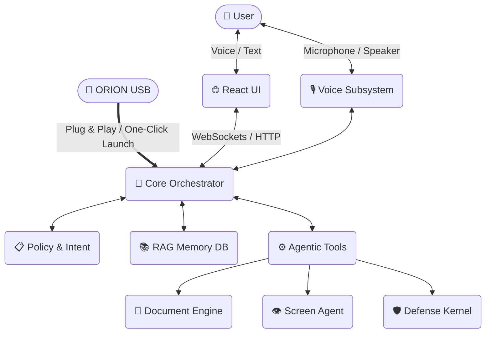

<div align="center">
  <h1>🌌 ORION AI</h1>
  <p><strong>The True Portable, Stealth & Autonomous AI Companion</strong></p>
  <p>
    
    
    
    
  </p>
</div>

---

## 🚀 Overview

**ORION** is a comprehensive, fully functional artificial intelligence system designed to run entirely offline from a USB flash drive. It features advanced voice interaction, document generation, an intelligent RAG (Retrieval-Augmented Generation) memory system, computer vision capabilities, and a stealth execution mode.

Whether you're operating on an air-gapped system or need a completely stateless and portable AI assistant, ORION brings cutting-edge capabilities with zero leftover footprint on the host machine.

## 📝 How it works

When you start ORION (by running `Start-ORION-USB.bat` or the equivalent launcher), a small bootstrapper script prepares the portable Python environment and spins up the backend servicers. A Flask‑based orchestration server loads the AI models and tools from the USB drive, connects the voice subsystem (for wake‑word detection, ASR and TTS), and opens a local web socket/HTTP interface for the React frontend.

All I/O, memory, and logs are redirected to folders on the USB stick; nothing is written to the host. The launcher also starts a lightweight watcher that monitors the USB connection – if the drive is removed the entire process tree is killed instantly, ensuring a zero‑trace exit. In short, ORION works by bundling every dependency with it, running entirely from RAM and the USB stick, and exposing a web interface on `localhost` for interaction.

---

## ✨ Core Features

- **🗣️ Voice-First Interaction**: Integrated Wake Word detection, continuous Speech-To-Text (ASR via Parakeet/Vosk), and Text-To-Speech capabilities mimicking natural conversation flows.
- **🧠 Intelligent Brain & Planner**: Context-aware orchestration that parses intent, manages conversation policies, and orchestrates complex multi-step tasks.
- **📚 RAG Memory System**: Long-term conversational memory with local vector stores that operate completely offline.
- **📄 Document Generation Engine**: Create beautifully formatted Markdown, Microsoft Word (`.docx`), and PowerPoint (`.pptx`) documents autonomously.
- **🛡️ Stealth & Security Kernel**: Orion's Defense Kernel monitors the host system. If the USB is disconnected, the engine executes a zero-trace graceful shutdown to protect user privacy.
- **🌐 React Frontend UI**: A sleek, modern Vite + React-based frontend providing chat interface, system status, and visual interactive feedback.
- **🔌 100% Portable "Plug-and-Play"**: No installation required on the host system. ORION runs on self-contained Python and Node.js environments.

---

## 🏗️ System Architecture




---

## 💻 How to Use (Portable USB Mode)

1. **Plug the Pendrive In:** Insert your USB drive into any Windows 10 or 11 computer.
2. **Launch ORION:** Double-click the yellow folder named **`ORION_System`** (or `Start-ORION-USB.bat` if viewing hidden files).
3. **Automatic Startup:** A small script runs invisibly in the background, spins up the backend sub-systems, and automatically opens your browser to `http://localhost:5173`.

> [!TIP]
> **First Launch Note:** The very first time you launch ORION on a new USB drive, it may take a few minutes to configure the environment and download basic dependencies. Every launch after that is near-instantaneous!

---

## ⚙️ Hardware Compatibility & Model Selection

ORION is deeply flexible and recognizes that different host PCs have different computational capabilities. You are not locked into a single AI model!

- **Low-End Hardware (CPU Only)**: You can configure ORION to use smaller, heavily quantified LLMs (like Llama 3 8B Q4) and CPU-optimized Speech-to-Text models (like Vosk) to ensure smooth, responsive performance on standard laptops.
- **High-End Hardware (Dedicated GPUs)**: If you plug ORION into a gaming PC or workstation with an Nvidia GPU, you can swap in full-precision, massive parameters models and leverage bleeding-edge ASR (like Nvidia Parakeet) for near-instant latency and incredible intelligence.

To swap models, simply drop your designated GGUF files or NeMo archives into the `models/` directory and update the config file!

---

## 🛡️ Security & Privacy (Zero-Trace)

To guarantee a clean, 1-click experience, ORION respects strict privacy boundaries:

- **100% Stateless on Host**: ORION will **never** save files, AI models, logs, or install anything onto the host computer's hard drive. All caches and history are safely rerouted straight back into `<USB_Drive>\ORION_USB\.cache`.
- **Dead Man's Switch**: If you suddenly yank the USB drive out of the computer, ORION's background watcher strictly kills all remaining background processes instantly. Nothing is left behind.

---

## 🧩 Directory Structure

```text
ORION_USB/
├── bin/                 # Bootstrapper & setup scripts (.bat & .ps1)
├── core/                # Core AI Engine, Tools, Orchestrator
├── memory/              # Vector DB, User context, Action ledgers
├── models/              # Local Large Language Models, STT, and TTS models
├── orion_ui/            # Modern React/Vite Frontend
├── python/              # Embedded Portable Python Environment
└── env/                 # Self-contained Pip Virtual Environment
```

---

## 🤝 Contribution & Deep Modification

To access the core code, model configurations, or edit the launcher scripts, keep in mind they might be hidden to keep the USB root neat:

1. Open your USB Drive in File Explorer.
2. At the top of File Explorer, click **View** > **Show** > **Hidden items**.
3. You will see the faded `ORION_USB` directory. Hop right in to hack the Python core inside `core/` or upgrade the React interface inside `orion_ui/`.

---

<div align="center">
  <p>Built for autonomous capability across all boundaries.</p>
</div>
